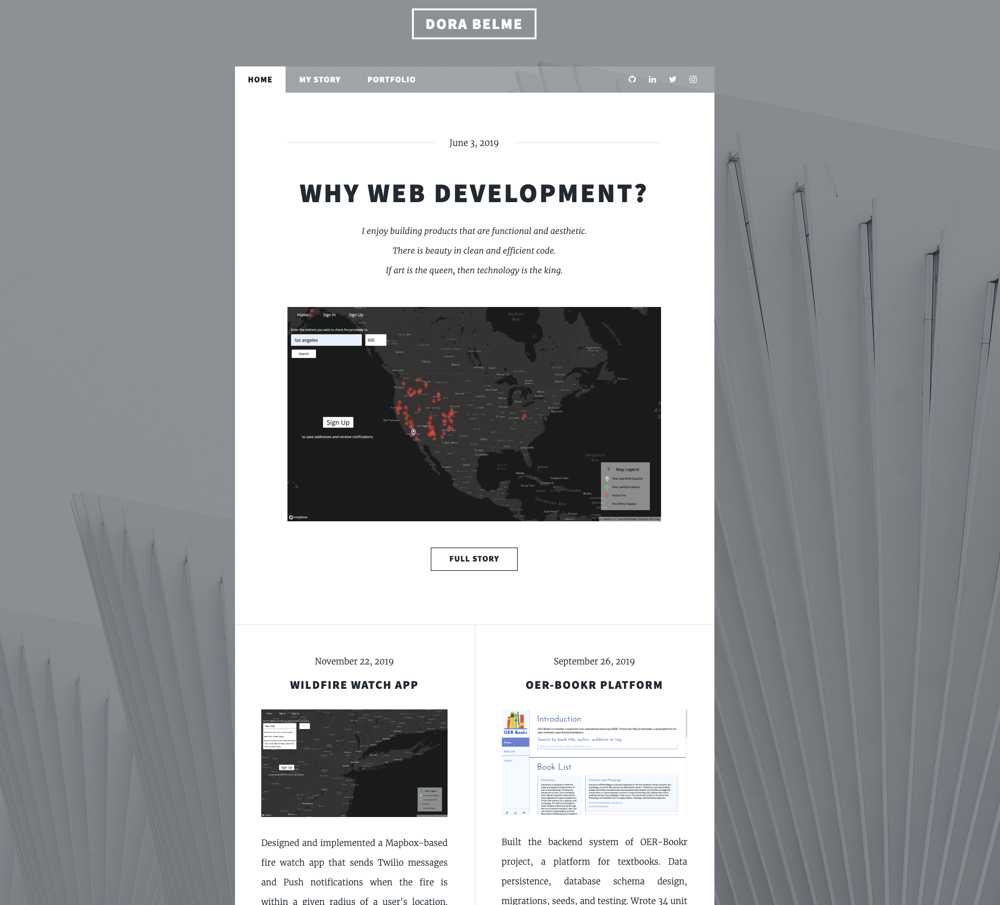

# [Portfolio Website](https://dora-belme.com/)

This is the source code for my portfolio website.

## Installation

1. `git clone https://github.com/dorabelme/portfolio-website.git`
2. Open `index.html` to access the site.
